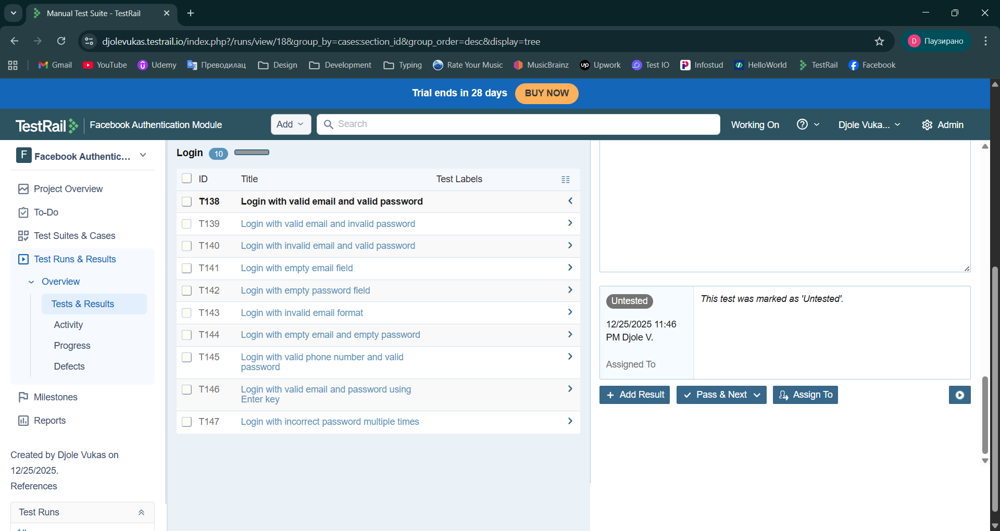

# Manual testing of web authentication using TestRail and Jira (Scrum workflow)

## Project Overview

This project demonstrates a structured manual QA workflow applied to a web authentication feature.

Scope of testing included:

- Login functionality
- Logout functionality
- Cross-browser validation
- Negative scenario validation
- Session behavior verification

Tools used:

- TestRail (test case design & execution structure)
- Jira (Scrum-based sprint tracking & issue management)
- Google Chrome
- Mozilla Firefox

---

## Test Case Design (TestRail Methodology)

Test cases were created using structured format including:

- Unique test IDs
- Defined preconditions
- Step-by-step execution
- Clear expected results
- Positive and negative scenarios

A total of 10 authentication-related test cases were designed.

#### Test Case Structure:

---
