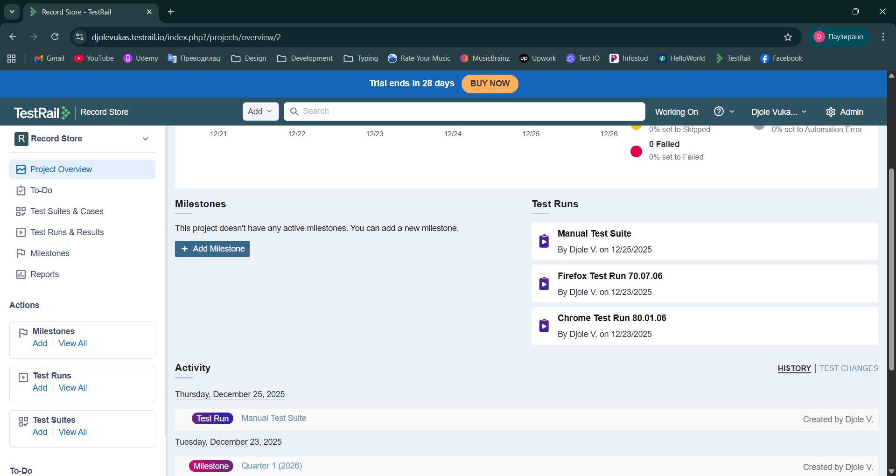
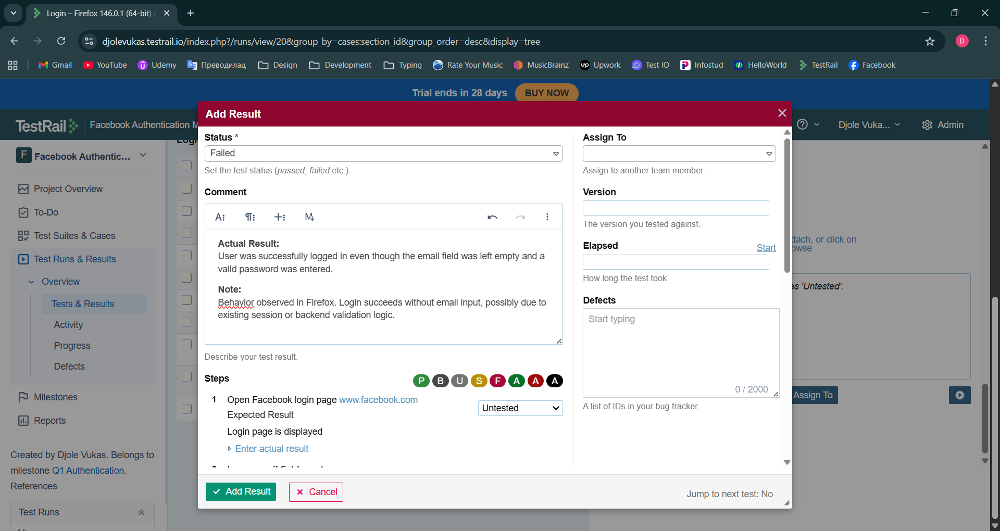
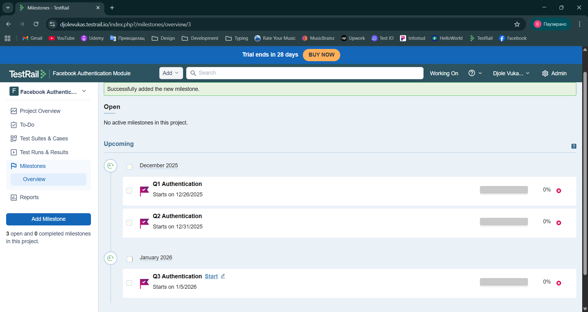
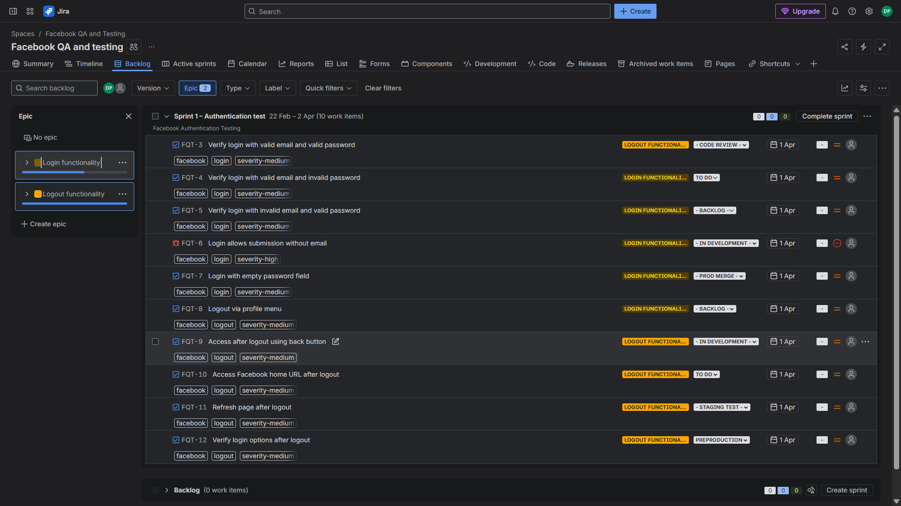
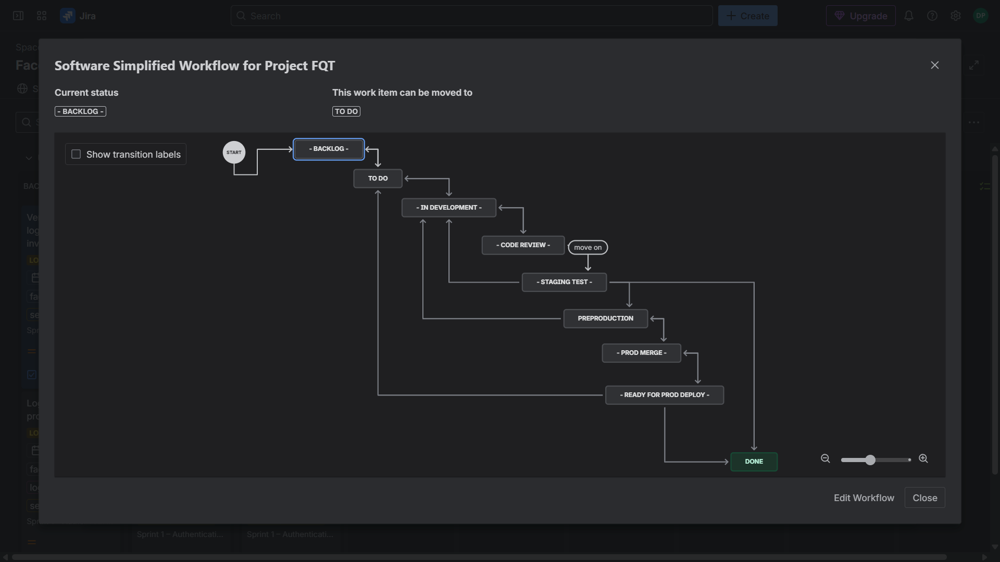
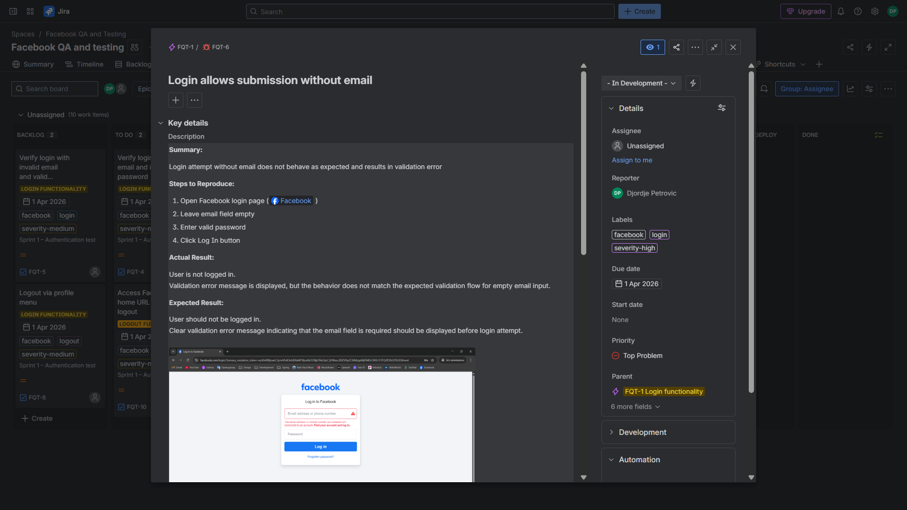
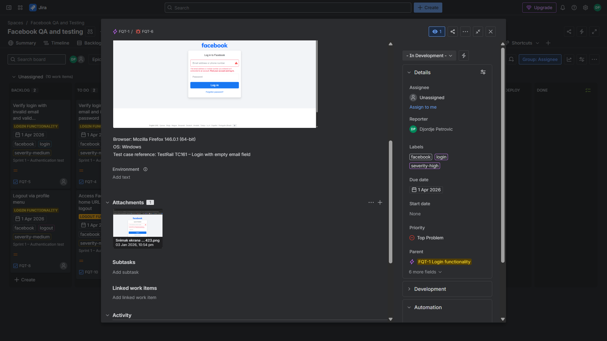
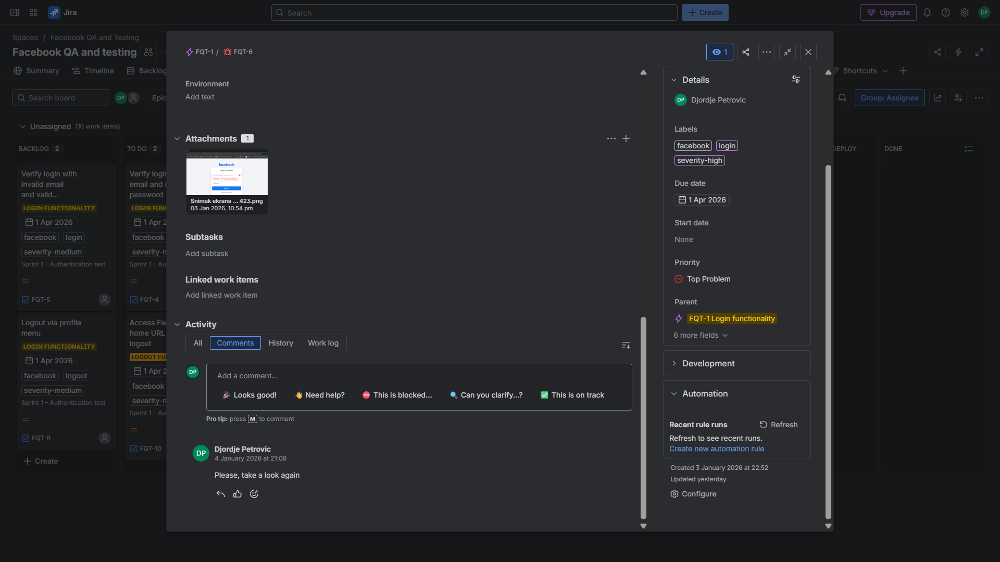
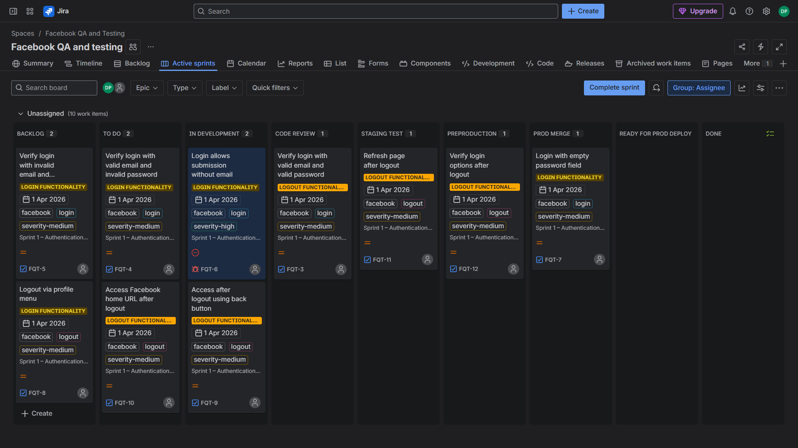

# Manual testing of web authentication using TestRail and Jira (Scrum workflow)

## Project Overview

This simple project demonstrates a structured manual QA workflow applied to a web authentication feature and highlights the role of a test scenario within the SDLC.

Scope of testing:

- Login / Logout functionality
- Cross-browser validation
- Negative scenario validation
- Session behavior verification

## Testing Framework & Environment

### Tools
- TestRail (test case design and execution management)
- Jira (Scrum-based sprint tracking and defect management)
- Google Chrome (cross-browser testing)
- Mozilla Firefox (cross-browser testing)
- Windows OS

### Methodology & Approach
- Agile (Scrum framework)
- Manual test execution
- Functional testing
- Black-box testing approach
- Positive and negative test design

---

## Test Case Design (TestRail)

- Unique test IDs
- Defined preconditions
- Step-by-step execution steps
- Clear expected results
- Positive and negative scenarios

A total of 10 authentication-related test cases were created.

#### Test Case Structure:

---

## Test Execution (Cross-Browser Validation)

Test cases were executed within separate test runs to validate authentication behavior across different browsers.

Execution was performed manually in:
- Google Chrome
- Mozilla Firefox

This ensured consistent functionality and behavior across environments.

#### Test Run Overview:

---

## Test Result Documentation

Test results were recorded directly within TestRail, including:

- Pass / Fail status
- Actual results
- Observations
- Environment-specific notes

This demonstrates structured defect documentation and clear traceability of execution outcomes.

#### Failed Test Example:

---

## Milestones & Progress Tracking

Milestones were defined to organize testing activities within planned phases of the authentication module.

This reflects structured test planning and progress tracking aligned with Agile workflow principles.

#### Milestone Overview:

---

## Sprint Planning & Workflow (Jira)

A Scrum-based Jira project was created to manage authentication-related testing activities aligned with the TestRail test suite.

The project structure reflects a realistic QA workflow including task tracking, defect management, and sprint execution.

---

## Project Structure (Epics & Tasks)

The authentication module was organized into two Epics:

- Login
- Logout

Each Epic contained five tasks, representing individual test scenarios.
Out of 10 total tasks:
- 9 were successfully validated
- 1 was reported and tracked as a bug

Labels and priorities were applied to support filtering and issue categorization.

#### Epic & Task Structure:

---

## Custom Workflow Configuration

A custom Scrum workflow was created to simulate a realistic software delivery lifecycle.

Statuses included:
- Backlog
- To Do
- In Development
- Code Review
- Staging Test
- Preproduction
- Prod Merge
- Ready for Deployment
- Done

Forward and backward transitions were configured to reflect iterative improvements and defect resolution flow.

#### Custom Workflow Overview:

---

## Issue Structure & Documentation

Each task included structured issue documentation:

- Summary
- Steps to reproduce
- Expected result
- Actual result
- Notes
- Attachments
- Assigned Epic
- Labels
- Priority

A custom priority level ("Top problem") was created for the identified defect.

#### Example Issue Documentation:

---

## Sprint Board & Tracking

All statuses were displayed within the Active Sprint board to visualize progress across the authentication workflow.

Filters and basic JQL queries were used to organize and analyze issue status and severity.

#### Active Sprint Board:

---

## Conclusion

This project represents a structured example of manual QA execution within a Scrum-based workflow.

It demonstrates test case design, cross-browser validation, defect documentation, and issue tracking using TestRail and Jira.
